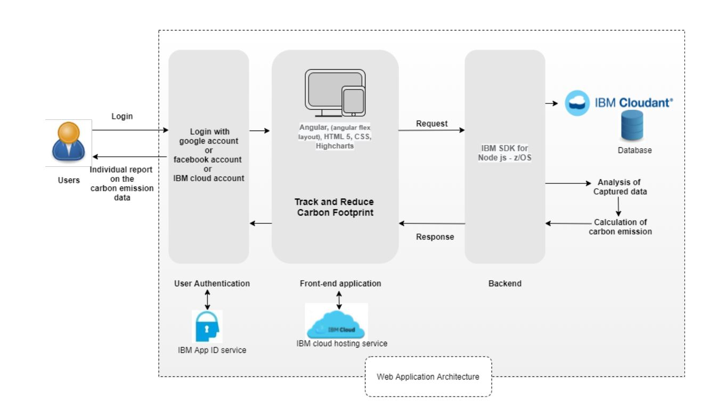
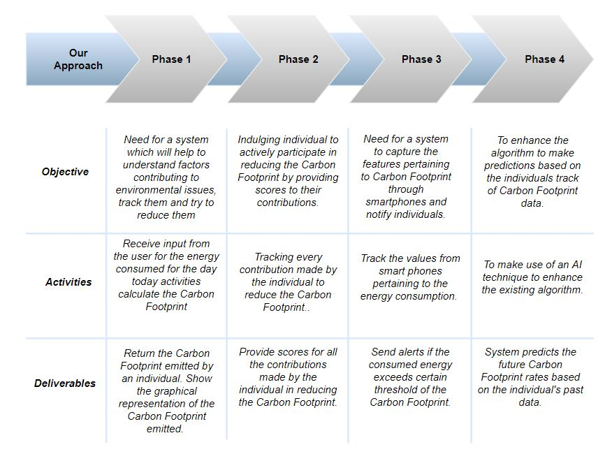

# Track and reduce Carbon Footprint

## Contents

- [Submission or project name](#track-and-reduce-carbon-footprint)
  - [Contents](#contents)
  - [Short description](#short-description)
    - [What's the problem?](#whats-the-problem)
    - [How can technology help?](#how-can-technology-help)
    - [The idea](#the-idea)
  - [Demo video](#demo-video)
  - [The architecture](#the-architecture)
  - [Long description](#long-description)
  - [Project roadmap](#project-roadmap)
  - [Getting started](#getting-started)
  - [Live demo](#live-demo)
  - [Built with](#built-with)
  - [Contributing](#contributing)
  - [Versioning](#versioning)
  - [Authors](#authors)
  - [License](#license)
  - [Acknowledgments](#acknowledgments)

## Short description

### What's the problem?

Planet is suffering due to climate changes and global warming
Sea levels are expected to rise between 10 and 32 inches or higher by the end of the century
Hurricanes and other storms are likely to become stronger. 
Floods and droughts will become more common
CO2 produced by human activities is the largest contributor to global warming
The electricity, oil and gas used to light and heat our homes and businesses is the single biggest contributing factor to climate change

### How can technology help?

The application allows the individual to enter the values for various carbon emission factors and calculates Carbon Footprint thereby making each and every individual aware about their ongoing Carbon Footprint activities. 
It also provides them a means to reduce the carbon footprint by improving and monitoring temperature controls,
reducing energy demand and replacing it with renewable and carbon neutral sources,
reducing how much people travel within the technology sector and using ICT tools as alternatives to travel across all industry

### The idea

Need for a system which will help to understand the factors contributing to environmental issues, track them and try to reduce them.
Reduce, Reuse and Recycle wherever possible.
Calculating Carbon footprint according to various factors can make people aware about seriousness of the situation and reduce un-necessary burden on planet earth.

## Demo video

## The architecture

1. User logins to the web application through google, facebook or the IBM account
2. The web application recieves input from the user for various carbon emission factors
3. The data is analysed and the carbon footprint is calculated and data is stored in the database
4. The calculated result is then displayed to the user

## Long description

[More detail is available here](./docs/DESCRIPTION.md)

## Project roadmap

The project currently does the following things

- Users can key in the carbon emission factor values
- Calculating Carbon footprint according to various factors
- Provides a graphical representation of the calculated Carbon Footprint
- Individual can take full responsibility for the climate impact by offsetting the emissions

See below for our proposed enhancement on next steps for Carbon Footprint calculation

## Getting started

This project was generated with [Angular CLI](https://github.com/angular/angular-cli) version 11.2.1.

- [sample-angular-app](./CarbonFootPrint/)
- [Project setup details](./docs/SETUP.md)

## Live demo

You can find a running system to test at [callforcode.mybluemix.net](http://callforcode.mybluemix.net/).

## Built with

- [IBM Cloudant](https://cloud.ibm.com/catalog?search=cloudant#search_results) - The NoSQL database used
- [IBM Cloud Functions](https://cloud.ibm.com/catalog?search=cloud%20functions#search_results) - To authenticate the user
- [IBM Toolchains](http://cloud.ibm.com/docs/ContinuousDelivery?topic=ContinuousDelivery-toolchains_getting_started) -For Continous Integration/Continous Deployment
- [IBM Express](https://developer.ibm.com/languages/node-js/tutorials/deploy-cloud-native-expressjs-app-to-a-hosted-kubernetes-cluster/) - Framework for Node.js to use API functions
- [Angular](https://angular.io/) - The web application framework used
- [Highcharts](https://www.highcharts.com/) - software library for chart designs
- [HTML 5](https://html.com/) - standard markup language for documents designed to be displayed in a web browser.
- [CSS](https://www.w3schools.com/html/html_css.asp) - Styling the web page

## Contributing

Please read [CONTRIBUTING.md](CONTRIBUTING.md) for details on our code of conduct, and the process for submitting pull requests to us.

## Versioning

We use [SemVer](http://semver.org/) for versioning. For the versions available, see the [tags on this repository](https://github.com/your/project/tags).

## Authors

- [Amol B Lande](https://github.com/amoll)
- [Susithra Chandrabose](https://github.com/susithrac)
- [Megha M](https://github.com/megha-30)
- [Chitkla S Kandekar](https://github.com/chitklak)

## License

This project is licensed under the Apache 2 License - see the [LICENSE](LICENSE) file for details.

## Acknowledgments

- Based on [Billie Thompson's README template](https://gist.github.com/PurpleBooth/109311bb0361f32d87a2).
